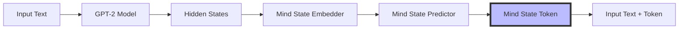
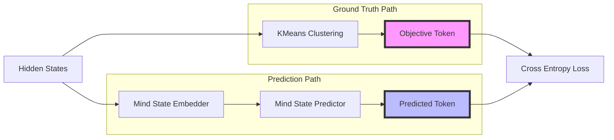

# Teaching AI Self-Awareness using Mind State Tokens

Hey there! 👋 Today, I'm excited to share a fun experiment in teaching AI models to be self-aware. This all started with a fascinating conversation with Elio from Audiogen and Monty from Prodia about how models could improve themselves.

## The Big Idea 💡

You know how humans are aware of their emotional and mental states? Well, what if we could teach an AI model to be aware of its own "mind states"? Here's the basic concept:



## How It Works 🔧

We're using GPT-2 as our base model (because it's small enough to run on Google Colab). The magic happens by adding special "mind state" tokens that the model learns to use. Here's a peek at how we set this up:

```python
class MindStateModel(torch.nn.Module):
    def __init__(self, base_model_name="gpt2"):
        super().__init__()
        self.model = GPT2LMHeadModel.from_pretrained(base_model_name)
        self.tokenizer = GPT2Tokenizer.from_pretrained(base_model_name)

        # Add our special mind state tokens
        self.mind_state_tokens = [f"<MIND_STATE_{i}>" for i in range(NUM_MIND_STATES)]
        self.tokenizer.add_tokens(self.mind_state_tokens)

```

## Creating Mind State Tokens 🧠

Here's where it gets interesting! We use KMeans to cluster the hidden states into mind state tokens. We then train two small models to predict the future mind state token.



The code is pretty neat:

```python
class MindStateEmbedder(torch.nn.Module):
    def __init__(self, input_size=768, embedding_size=64):
        super().__init__()
        self.attention = torch.nn.Linear(input_size, 1)
        self.linear1 = torch.nn.Linear(input_size, embedding_size)
        
class MindStatePredictor(torch.nn.Module):
    def __init__(self, input_size=64, hidden_size=128):
        super().__init__()
        self.linear1 = torch.nn.Linear(input_size, hidden_size)
        self.linear2 = torch.nn.Linear(hidden_size, NUM_MIND_STATES)
```

These two models can be seen as one as they get trained together. 

The predicted mind state gets added as a special token at the end of each sequence:

```python
# Example input text
text = "The quick brown fox jumps over the lazy dog"

# Model processes text and predicts next mind state
# Let's say it predicts mind state 3 out of 25 possible states

# Final output with mind state token
output = "The quick brown fox jumps over the lazy dog <MIND_STATE_3>"
```

## What I learned 📊


Adding new tokens to a pretrained model make the loss jump up at the start. You can also see the loss on the mind state jump up at step 500 and 1000. This is because I tried refitting the KMeans at those steps. 


As you can see in this image not all mind states are used. I assume this is because i was only training on the wikitext dataset which is not as diverse as the original training data. 

## What's Next? 🚀

This is just the beginning! I’m thinking about:

1. Experimenting with different clustering approaches
2. Exploring connections with attention sinks
3. Making the model truly self-improving by letting it modify its own objective function

## Want to Try It Yourself? 🛠️

Shoot me a note at antoine@inkdrop.ai, I would love to chat through the details with you!

## Final Thoughts 💭

Is this the path to AGI? Maybe, maybe not. But it's a fun experiment in making models more aware of their own states. 

If you have ideas for improvements, drop them in the comments below.

Happy coding! 🎉
